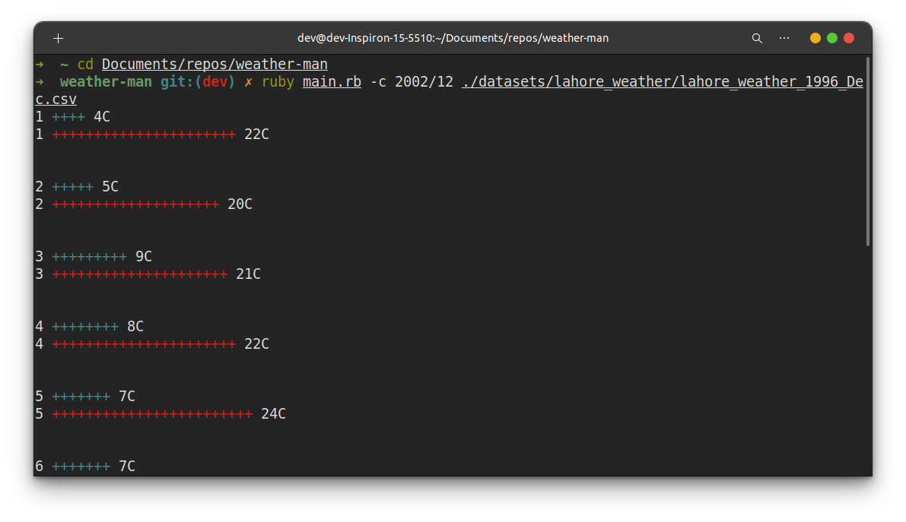

# Weather Man

Weather Man is CLI tool for analyzing and visualizing weather based data.



## Installation

For UNIX based operating systems

```bash
git clone https://github.com/usman6666ahmed/weather-man.git
cd weather-man
chmod +x main.rb
./main.rb ...args
```

OR

```bash
git clone https://github.com/usman6666ahmed/weather-man.git
cd weather-man
ruby main.rb ...args
```

For Windows

```bash
git clone https://github.com/usman6666ahmed/weather-man.git
cd weather-man
ruby main.rb ..args
```

## Usage

Weather Man has 3 options to analyze datasets

1. For a given year display the highest temperature and day, lowest temperature and day, most humid day and humidity.

2. For a given month display the average highest temperature, average lowest temperature, average humidity.

3. For a given month draw two horizontal bar charts on the console for the highest and lowest temperature on each day. Highest in red and lowest in blue.

```bash
./main.rb -option year/month /path/to/file/or/folder

./main.rb -e 2002 ./datasets/lahore_weather

./main.rb -a 2002/12 ./datasets/lahore_weather/lahore_weather_1996_Dec.csv

./main.rb -c 2002/12 ./datasets/lahore_weather/lahore_weather_1996_Dec.csv

```

## Contributing

Any contributions ranging from linting fixes, spelling fixes to architectural improvements are welcome

## License

[MIT](https://choosealicense.com/licenses/mit/)
